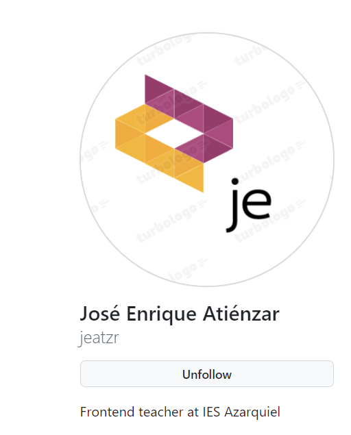

# Practice 1.1 - Installing and configuring Web Development Tools

### 2DAW - DWEC Bilingual. 

> **Student Name**:  Daniel Sánchez Ruiz

#### Files included in this repository:

Ennumerate and explain each one of the files included in this repo.

- File 1
- File 2
- Etc...

#### Instructions: 

- Fill your name and lastname and answer the questions in the current `README.md` file. You have to submit the activity as a GitHub repo link that has to include the 

- You can add images to this tocument with the syntax:

    ```md
    
    ```

- Any other question about Markdown language you can find in the [Markdown Cheat Sheet](https://www.markdownguide.org/cheat-sheet/)

### Install and configure VSCode

1. **Install `VSCode` in your computer**.
    I have installed it since the previous year.
2. **Create a new folder called `p1.1-frontend-tools`and open it as a workspace in VSCode. Copy the current `README.md` inside it**.
3. **What functionalities do the following VSCode extensions add?**
   - **Bootstrap 5 quick Snippets**: It contains 179 code snippets to build Bootstrap UI faster. This plugin works both in the stable & the insiders build.
   - **Live Server**: It'll enable live changes without saving file.
   - **Prettier**: It enforces a consistent style by parsing your code and re-printing it with its own rules that take the maximum line length into account, wrapping code when necessary.
   - **Markdown All in One**: Working with Markdown is simple, straightforward, and fun. Besides VS Code's basic editing, there are a several Markdown-specific features that help you be more productive.
4. **Install the extensions listed in the previous point in VSCode**.
   I have installed it
5. **What other extensions do you know that you consider interesting for developing in JavaScript**?
   I don´t know other extension for doveloping in JavaScript.
6. **Find in VSCode the option in `Settings` to `Format On Save` and activate it. What effect has this option?**
    The file must not be saved after delay, and the editor must not be shutting down.
### Create a Hello World in JS

1. **Create an `index.html` file inside your worspace folder.**
   
2. **Create the basic html structure using the `!` snippet and change the title to 'Hello World'**

    ````html
    <!DOCTYPE html>
    <html lang="en">
    <head>
      <meta charset="UTF-8">
      <meta name="viewport" content="width=device-width, initial-scale=1.0">
      <title>Hello World</title>
    </head>
    <body>
      
    </body>
    </html>
    ````

3. **Create a new file called `app.js` and add this two lines**

    ````javascript
    console.log("Hello Console!")
    document.body.innerHTML = "<h1>Hello document!<h1>"
    ````

4.  **Import the script in your html using one of the techniques explained in class. Explain here the technique, show the code and justify why did you choose this technique**.
   I use the technique of External javascript that allows me to include JavaScript from an external file using the script tag with the src attribute.

5.  **Launch `index.html` in Live Server and check that the script is running. Click right button and select inspect to show the developer tools and take a look on the console.**


    
1.  **Change some message in the JS code and sava changes. You can check that Live Server refreshes the web page.**


### Create a simple form with Bootstrap 4. 

13. **At this point, we are going to create a page called `form.html` starting from the `Bs5-$` template provided by the Bootstrap extension we added. What files does this template import in the html by default?**
    A header, main and footer
14. **Create a `<div>`with the class `.container` to wrap all the sections in the web page**
  
1.  **Add a standard navigation bar inside the nav area using the `bs5-navbar-standard` snippet inside the container**
    
2.  **Inside the main area create a form using Bootstrap to collect data from a new user who wants to register at an academy that offers courses. We can copy code from [Bootstrap Documentation](https://getbootstrap.com/docs/5.0/forms/overview/)**. 

### Install Git, and upload your project to GitHub

17. **Install [git](https://git-scm.com/) in your computer**.
    
18. **Init the git project**
    
19. **Log in to your GitHub account provided by IES Azarquiel**
    
20. **Follow the teacher on GitHub at the following link: [https://github.com/jeatzr/](https://github.com/jeatzr/)**
    
21. **Create a new empty project on GitHub named `p1.1-frontend-tools`.**
    
22. **Follow the instructions in the command line provided by GitHub to add your files, create the first commit and push it. Notice that in out case we have to add all files to the staged area with `git add .`, not just`git add README.md`** 
    
    
23. **To finish, submit the link of your GH repo to the task in our Classroom.**
    [p1.1-frontend-tools](https://github.com/DanielSanrui/p1.1-frontend-tools)